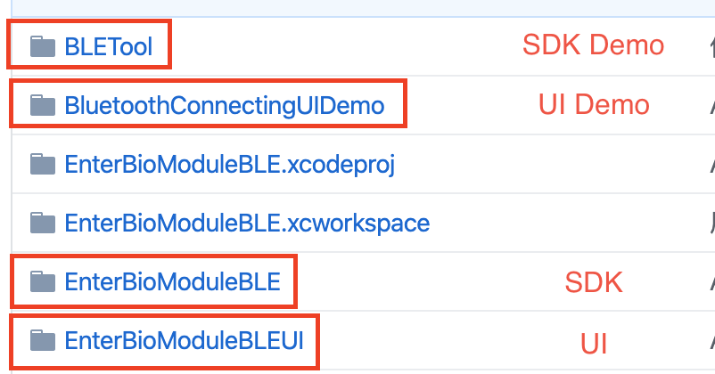
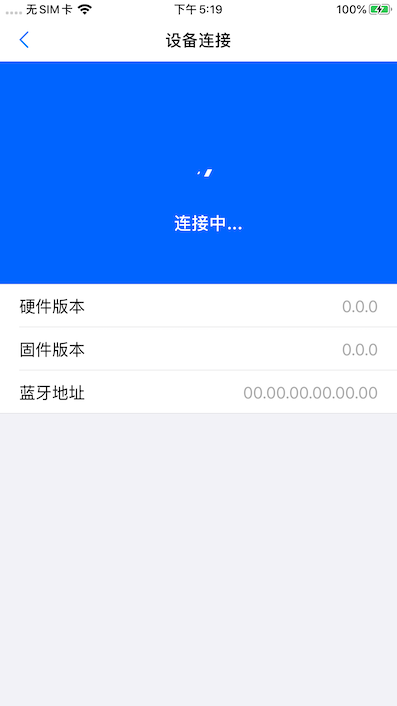
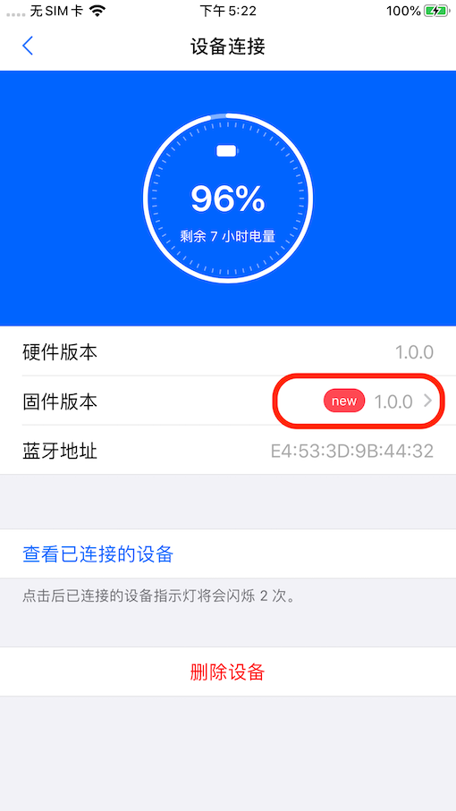
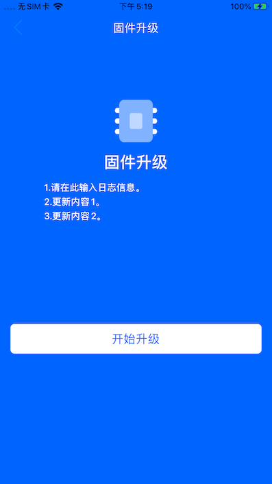

# Enter Biomodule BLE SDK

# 目录

- [Enter Biomodule BLE SDK](#enter-biomodule-ble-sdk)
- [目录](#%e7%9b%ae%e5%bd%95)
- [SDK 说明](#sdk-%e8%af%b4%e6%98%8e)
  - [介绍](#%e4%bb%8b%e7%bb%8d)
  - [结构说明](#%e7%bb%93%e6%9e%84%e8%af%b4%e6%98%8e)
  - [安装集成](#%e5%ae%89%e8%a3%85%e9%9b%86%e6%88%90)
    - [CocoaPods](#cocoapods)
  - [快速接入](#%e5%bf%ab%e9%80%9f%e6%8e%a5%e5%85%a5)
    - [蓝牙连接](#%e8%93%9d%e7%89%99%e8%bf%9e%e6%8e%a5)
    - [脑电服务订阅](#%e8%84%91%e7%94%b5%e6%9c%8d%e5%8a%a1%e8%ae%a2%e9%98%85)
    - [心率数据订阅](#%e5%bf%83%e7%8e%87%e6%95%b0%e6%8d%ae%e8%ae%a2%e9%98%85)
  - [API说明](#api%e8%af%b4%e6%98%8e)
- [蓝牙UI](#%e8%93%9d%e7%89%99ui)
  - [蓝牙连接UI](#%e8%93%9d%e7%89%99%e8%bf%9e%e6%8e%a5ui)
    - [参数](#%e5%8f%82%e6%95%b0)
    - [集成方式](#%e9%9b%86%e6%88%90%e6%96%b9%e5%bc%8f)
    - [图示](#%e5%9b%be%e7%a4%ba)
  - [固件升级UI](#%e5%9b%ba%e4%bb%b6%e5%8d%87%e7%ba%a7ui)
    - [参数](#%e5%8f%82%e6%95%b0-1)
    - [集成方式](#%e9%9b%86%e6%88%90%e6%96%b9%e5%bc%8f-1)
    - [图示](#%e5%9b%be%e7%a4%ba-1)

# SDK 说明
## 介绍

本 SDK 包含回车生物电采集模块的蓝牙连接和生物电采集控制。通过此 SDK 可以在 iOS app 里快速实现和我们的采集模块连接，并控制其进行数据的采集和停止等指令。`EnterBioModuleBLEUI`提供了蓝牙连接的UI和通过蓝牙升级固件的UI

## 结构说明

> 运行 Demo 需要 `pod install` 和 `carthage bootstrap`
 
工程有两部分组成：Demo + SDK framework 源码。 
如图：



## 安装集成

集成我们的 SDK 有以下方式：

### CocoaPods

1. add the following to your `Podfile`

~~~swift
pod 'EnterBioModuleBLE'
pod 'EnterBioModuleBLEUI' #(根据需求添加)
~~~

1. Integrate your dependencies using frameworks: add use_frameworks! to your `Podfile`.
2. Run `pod install`


## 快速接入

> 为了能够简单快捷的调用以上硬件连接接口和服务接口，将接口做了整合

### 蓝牙连接

~~~swift
// 扫描周围设备3秒，取信号最强的一个进行连接, 同时将开启电量服务
let manager = BLEManager()
manager.scanAndConnect { completed in
    // your code
}
~~~

~~~swift 
// 断开链接
manager.disconnect()
~~~

实现订阅协议 BLEStateDelegate, 获取连接状态，获取电量
~~~swift 
manager.delegate = self

/// 数据连接的代理方法
func bleConnectionStateChanged(state: BLEConnectionState, bleManager: BLEManager) {}

/// 电量获取的代理方法
func bleBatteryReceived(battery: Battery, bleManager: BLEManager) {}
~~~


### 脑电服务订阅

~~~swift 
// 订阅脑电数据，并打开脱落检测
manager.startEEG()
~~~

~~~swift 
// 关闭脑电数据订阅
manager.stopEEG()
~~~

实现订阅协议 BLEBioModuleDataSource, 获取EEG数据
~~~swift 
// 实现代理
manager.dataSource = self

/// eeg数据获取的代理方法
func bleBrainwaveDataReceived(data: Data, bleManager: BLEManager){}
~~~

### 心率数据订阅

~~~swift
// 开启脑电数据订阅
manager.startHeartRate()
~~~

~~~swift
// 关闭脑电数据订阅
manager.stopHeartRate()
~~~

实现订阅协议 BLEBioModuleDataSource, 获取心率数据

~~~swift
// 实现代理
manager.dataSource = self

/// 心率获取的代理方法
func bleHeartRateDataReceived(data: Data, bleManager: BLEManager){}
~~~

## API说明
请参见[EnterrBioModuleBLE API说明](APIDocuments/API.md)


# 蓝牙UI

> 为了方便用户快速接入, 我们提供了标准的蓝牙连接UI模块和固件升级UI模块

## 蓝牙连接UI

### 参数

| 参数              | 类型    | 默认值  | 说明                                                       |
| ----------------- | ------- | ------- | ---------------------------------------------------------- |
| cornerRadius      | CGFloat | 8       | 控件圆角                                                   |
| mainColor         | UIColor | #0064FF | 主色调                                                     |
| isConnectByMac    | Bool    | false   | true时, 第一次连接设备会记录mac地址,后续连接会判断是否匹配 |
| firmwareVersion   | String  | "0.0.1" | 如果您拥有新固件,连接后会判断新固件版本是否比当前当高      |
| firmwareURL       | URL     | nil     | 放入沙盒的固件位置                                         |
| firmwareUpdateLog | String  | ""      | 更新内容说明                                               |

### 集成方式

~~~swift
let connection = BLEConnectViewController(bleManager: manager)
// let connection = BLEConnectViewController(bleManagers: [manager1, manager2]] //多个设备时使用
connection.cornerRadius = 6
connection.mainColor = UIColor(red: 0, green: 100.0/255.0, blue: 1, alpha: 1)
connection.isConnectByMac = true // mac地址连接
self.present(connection, animated: true, completion: nil)
~~~

### 图示



## 固件升级UI

### 参数 

| 参数              | 类型    | 默认值  | 说明                                                       |
| ----------------- | ------- | ------- | ---------------------------------------------------------- |
| firmwareVersion   | String  | "0.0.1" | 如果您拥有新固件,连接后会判断新固件版本是否比当前当高      |
| firmwareURL       | URL     | nil     | 放入沙盒的固件位置                                         |
| firmwareUpdateLog | String  | ""      | 更新内容说明                                               |

### 集成方式

```swift
// let connection = BLEConnectViewController(bleManager: manager) 在蓝牙连接UI集成时添加下列参数
connection.firmwareVersion  = "1.2.1"
connection.firmwareURL = Bundle.main.url(forResource: "1.2.1", withExtension: "zip")
connection.firmwareUpdateLog = "1.请在此输入日志信息。\n2.更新内容1。\n3.更新内容2。"
```

### 图示

当设置升级固件时, 连接蓝牙后会有升级提示



点击升级提示后, 转到升级界面


