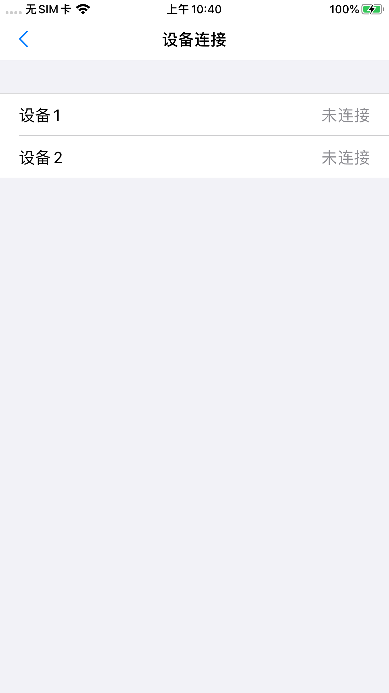
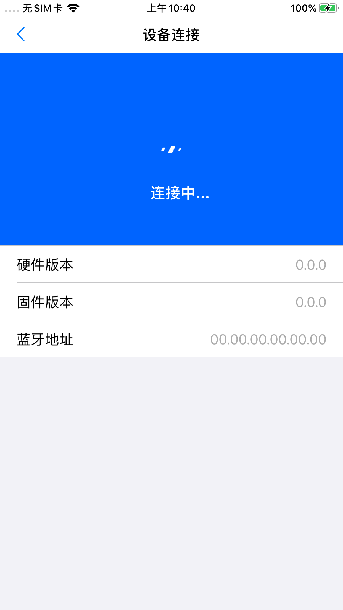

# 蓝牙UI Demo

- [蓝牙UI Demo](#%e8%93%9d%e7%89%99ui-demo)
  - [简介](#%e7%ae%80%e4%bb%8b)
  - [依赖库](#%e4%be%9d%e8%b5%96%e5%ba%93)
  - [工程说明](#%e5%b7%a5%e7%a8%8b%e8%af%b4%e6%98%8e)
    - [运行环境](#%e8%bf%90%e8%a1%8c%e7%8e%af%e5%a2%83)
    - [内容](#%e5%86%85%e5%ae%b9)
    - [运行](#%e8%bf%90%e8%a1%8c)
    - [页面展示](#%e9%a1%b5%e9%9d%a2%e5%b1%95%e7%a4%ba)

## 简介 

本工程主要集成了`EnterBioModuleBLEUI`的UI库，展示UI库的集成方式。

## 依赖库

UI SDK请参见[EnterBioModuleBLEUI](../EnterBioModuleBLEUI/)

Demo使用`Cocopods`管理依赖库，使用前要先对工程主目录运行`pod install`。

## 工程说明

### 运行环境

Xcode 11, iOS 13

### 内容

本工程展示了`EnterBioModuleBLEUI`库的蓝牙连接，固件升级，通过mac地址连接等功能。其中固件本Demo不提供，如需要请与合作方洽谈。

### 运行

运行本工程，点击`Show Navigation`按钮，UI库所集成的`BLEConnectViewController`会以模态的形式出现，自带导航栏，会自动管理navigation栈的层级。

### 页面展示

管理界面（只有多设备才有）

提示界面

连接界面

